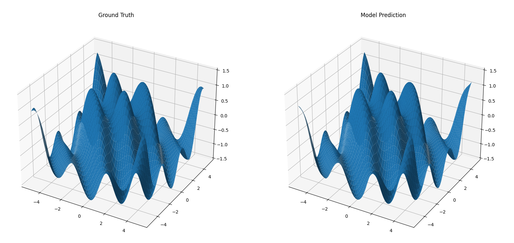

# MLP Function Approximation (Abdallah Mohammed Ramzi)

## Step 1: Dataset Generation and Visualization

### What we did

- Generated 2000 random points $(x, y)$ in the range $[-5, 5]$
- Computed the real output $z$ using the function $f(x, y)$
- Normalized the input $(X)$ and output $(y)$ using Z-Score normalization
- Visualized the ground truth using:
  - Heatmap
  - Surface plot

### Goal

Prepare clean data and understand the function before training the MLP

---

## Step 2: MLP Architecture and Forward Pass

### What we did

- Built a Multilayer Perceptron (MLP) from scratch using NumPy
- Defined the architecture: $[2 \to 128 \to 128 \to 64 \to 1]$
- Initialized weights using He initialization
- Implemented activation functions:
  - Tanh for hidden layers
  - Linear for output layer

- Implemented the forward pass through all layers
- Implemented Mean Squared Error (MSE) as the loss function
- Tested the model by generating predictions and computing the loss

#### Why this architecture and activation choice

- The target function is nonlinear and oscillatory, so deeper hidden layers help capture complex patterns.
- Tanh is smooth and nonlinear, which is suitable for continuous function approximation.
- Linear activation in the output layer is appropriate for regression because output values are continuous.
- The 128-128-64 hidden structure gives enough capacity without making the model too deep.

### Goal

Build the neural network structure and ensure it can produce predictions before training

---

## Step 3: Training, Backpropagation, and Optimization

### What we did

- Implemented a full training loop using a dedicated Trainer class
- Trained the model for 1000 epochs
- Used mini-batch gradient descent on the normalized training dataset
- For each epoch:
  - Performed a forward pass to get predictions
  - Computed the MSE loss
  - Computed the gradient of the loss with respect to the predictions
  - Backpropagated the gradient through all layers in reverse order
  - Updated weights and biases using SGD with momentum

- Used a learning rate of 0.15, momentum of 0.9, and mini-batch size of 32
- Printed the loss every 100 epochs to monitor convergence
- Plotted the training loss live during training to visualize progress

#### Why momentum helped

- Momentum accumulates past gradients and smooths the update direction.
- It reduces small oscillations and helps the optimizer move faster in the main descent direction.
- With our function, it improved convergence and reduced the final error compared to plain SGD.
- Mini-batches made updates more frequent, which sped up learning even more.

### Goal

Train the MLP end-to-end so it learns the mapping from $(x, y)$ to $z$ and reduces the prediction error.

---

## Step 4: Evaluation, Comparison, and Model Logging

### What we did

- Split the generated dataset into 80% training data and 20% test data
- Normalized the test set using the training statistics only
- Evaluated the trained model visually after training
- Created a dense 2D grid over the input space
- Computed the ground truth values on the grid using the original function $f(x, y)$
- Predicted the model outputs on the same grid
- Applied normalization and denormalization correctly during grid prediction
- Visualized the results using side-by-side 3D surfaces:
  - Ground truth surface
  - Model prediction surface

- Logged all trained parameters, including weights and biases, into a timestamped file for reproducibility and debugging
- Reported the final test MSE on unseen data to measure generalization
- Mentioned that the test error stayed extremely low with the mini-batch setup

#### Why this evaluation is important

- Surface comparison is a direct way to check whether the model learned the shape of the function.
- Denormalizing predictions ensures the outputs are interpreted in the original scale.
- Logging parameters helps inspect the trained network later and reproduce the results.
- The test split gives a more honest estimate of how the model performs on unseen points.

### Goal

Validate that the trained MLP approximates the original function well and keep a persistent record of the learned parameters.

---

## Final Pipeline Summary

- Generate the dataset and split it into train/test sets
- Normalize the training set and reuse its statistics for the test set
- Build the MLP with architecture $[2 \to 128 \to 128 \to 64 \to 1]$ using Tanh hidden activations and Linear output activation
- Train the model with MSE loss, backpropagation, SGD with momentum, and mini-batches
- Monitor the loss during training, compare the predicted surface with the true surface, and evaluate the test MSE on unseen data
- Save the trained weights and biases for later analysis

---

## Results Reached

After training, the MLP learned the general shape of the target function very well. The predicted surface follows the same oscillatory behavior as the ground truth, with only small differences in some regions. With mini-batch training, the convergence became much faster and the final error became extremely low, showing that the model successfully approximated the nonlinear function and that the chosen architecture and training procedure were effective for this task.

### Final Numbers

- Training MSE: approximately $1.6 \times 10^{-4}$
- Test MSE: approximately $2.2 \times 10^{-4}$
- Mesh MSE: approximately $1.5 \times 10^{-4}$
- Training setup: SGD with momentum, learning rate $0.15$, mini-batch size $32$

### Ground Truth vs Model Prediction

